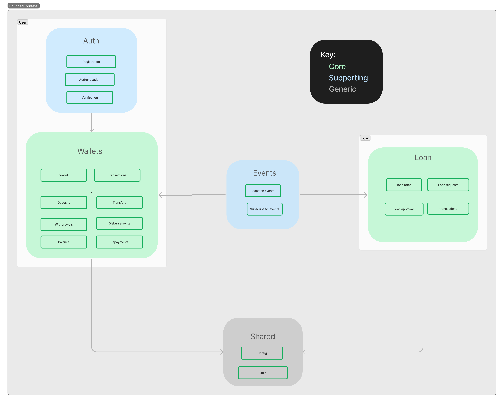
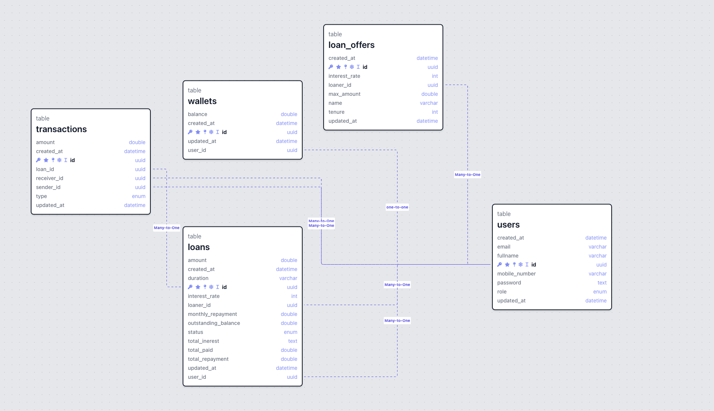

<h1 align="center">DemoCredit</h1>

## About

**DemoCredit** is a mobile lending application that includes essential wallet functionality for borrowers. This allows users to receive loans and manage repayments efficiently. 

### Key Features
- User account creation
- Fund account functionality
- Transfer funds between users
- Withdraw funds from the account
- Blacklist check against Lendsqr Adjutor Karma for onboarding

## Running the Project

### Prerequisites
1. Install and start [Docker](https://docs.docker.com/compose/gettingstarted/) (Skip if using a hosted MySQL and Redis).
  
### Setup Instructions
1. **Create the `.env` file**: Required environment variables can be found in `/src/shared/config`.
2. **Build and run** the MySQL and Redis images:
   ```bash
   docker-compose up
   ```
3. **Run the server** in a new console:
   ```bash
   npm run dev
   ```
   The server will be available at `http://localhost:3000`. Refer to the documentation for available endpoints and usage.

### Documentation
[Visit the API Documentation](https://documenter.getpostman.com/view/24186009/2sAXxWZoxP) for detailed information on endpoints.

## Built With

### Backend Technologies
- [Node.js](https://nodejs.org/) - LTS version
- [Knex.js](http://knexjs.org/)
- [MySQL](https://www.mysql.com/)
- [TypeScript](https://www.typescriptlang.org/)
- [Express.js](https://expressjs.com/) - Lightweight web server
- [Redis](https://redis.io/) - For managing JWT and refresh tokens

## Architecture

DemoCredit is built using **Clean Architecture**, adhering to OOP principles and Domain-Driven Design best practices with TypeScript.

### Clean Architecture Overview
Clean Architecture helps organize application logic effectively.


### Subdomains
The application is divided into two main subdomains: **User** and **Loan**.


#### User Subdomain
Focuses on authentication and user management.
- **Domain Layer**: User aggregate root, userEmail value object, userCreated domain event.
- **Application Layer**: Use cases for registration and wallet viewing.
- **Adapter Layer**: IUserRepo repository interface.
- **Infrastructure Layer**: KnexUserRepo implementation and UserDTO objects.

#### Loan Subdomain
Manages loan creation and operations.
- **Domain Layer**: Loan and loan offer concepts.
- **Application Layer**: Use cases for creating, approving, and declining loans.
- **Adapter Layer**: ILoanRepo.
- **Infrastructure Layer**: KnexLoanRepo.

### Bounded Context


## Database Entity Relationship
The DemoCredit database consists of five tables: users, wallets, loan-offers, loans, and transactions. Each user has a single wallet, and transactions can be linked to users or loans. Loan requests are made against available offers, which can only be posted by admin users.



## Flow of Operation
1. **User Registration**: The system checks against the Lendsqr Adjutor Karma blacklist via the Adjutor API. Blacklisted users cannot onboard.
2. **Wallet Creation**: Upon successful registration, a wallet is automatically created using an event-driven approach.
3. **User Actions**: Registered users can:
   - Fund their wallets
   - Withdraw funds
   - Transfer funds to other users
   - Request loans against available offers
4. **Admin Actions**: Admin users can post loan offers and approve or reject loan requests, dispatching relevant events for processing.
5. **Loan Management**: Users can view their active and rejected loans, access payment details, and make repayments. Events are dispatched to update user balances upon repayment.

